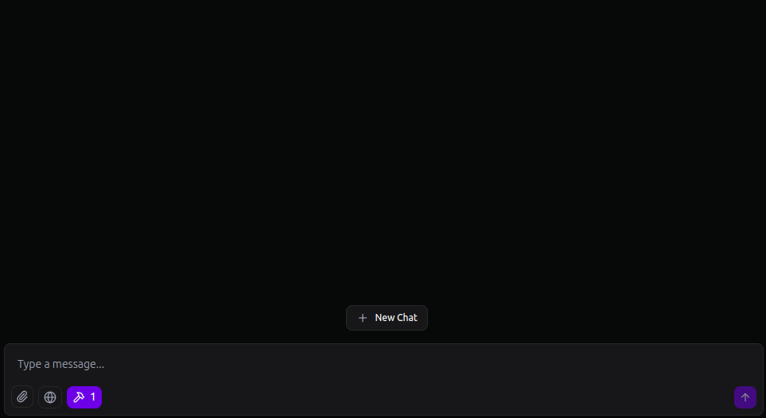

<div align="center">


<h1>Weather API MCP Server</h1>

[](LICENSE)
[](go.mod)
[](https://goreportcard.com/report/github.com/TuanKiri/weather-mcp-server)
[](https://github.com/TuanKiri/weather-mcp-server/actions?workflow=Build)

<strong>[Report Bug](https://github.com/TuanKiri/weather-mcp-server/issues/new?assignees=&labels=bug&projects=&template=bug_report.yml)</strong> | <strong>[Request Feature](https://github.com/TuanKiri/weather-mcp-server/issues/new?assignees=&labels=enhancement&projects=&template=feature_request.yml)</strong>

</div>

A lightweight Model Context Protocol (MCP) server that enables AI assistants like Claude to retrieve and interpret real-time weather data.

<div align="center">

</div>

## Installing on Claude Desktop

To use your MCP server with Claude Desktop, add it to your Claude configuration:

#### 1. Local mode

```json
{
  "mcpServers": {
    "weather-mcp-server": {
      "command": "/path/to/weather-mcp-server",
      "args": [],
      "env": {
        "WEATHER_API_KEY": "your-api-key"
      }
    }
  }
}
```

You can get an API key from your personal account on [WeatherAPI](https://www.weatherapi.com/my/).

#### 2. Remote mode

```json
{
  "mcpServers": {
    "weather-mcp-server": {
      "url": "http://host:port/sse"
    }
  }
}
```

## Build from source

You can use `go` to build the binary in the `cmd/github-mcp-server` directory.

```shell
go build -o weather-mcp-server ./cmd/weather-mcp-server
```

## Using MCP with Docker Containers

#### 1. Build the Docker image:

```shell
docker build -t weather-mcp-server .
```

#### 2. Run the Docker Container:

```shell
docker run -e WEATHER_API_KEY=your-api-key -d --name weather-mcp-server -p 8000:8000 weather-mcp-server
```

Replace `your-api-key` with your actual [WeatherAPI](https://www.weatherapi.com/my/) API key.

## Tools

- **current_weather** - Gets the current weather for a city

  - `city`: The name of the city (string, required)

## Project Structure

The project is organized into several key directories:

```shell
├── cmd
│   └── weather-mcp-server
├── internal
│   └── server
│       ├── handlers # MCP handlers
│       ├── services # Business logic layer
│       │   ├── core # Core application logic
│       │   └── mock # Mock services for testing
│       ├── tools # MCP tools
│       └── view # Templates for displaying messages
└── pkg
```

## Contributing

Feel free to open tickets or send pull requests with improvements. Thanks in advance for your help!

Please follow the [contribution guidelines](.github/CONTRIBUTING.md).

## License

This MCP server is licensed under the [MIT License](LICENSE).
